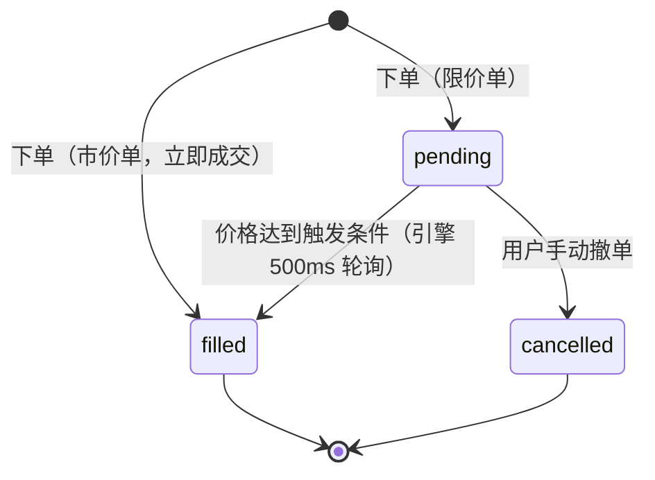
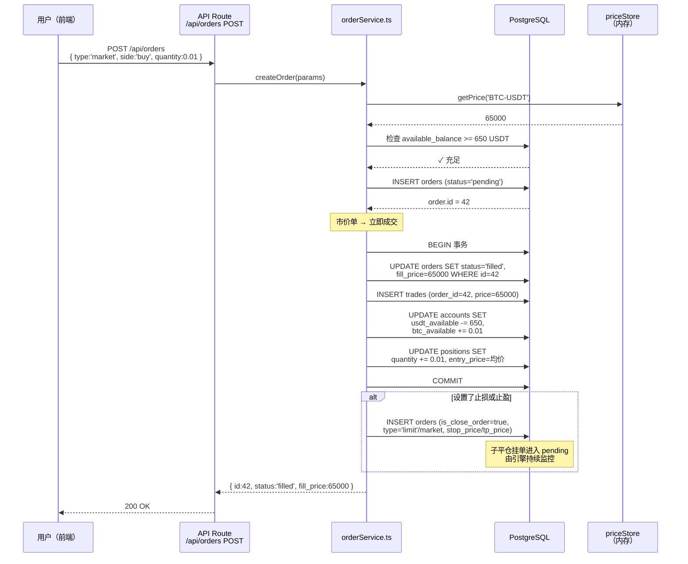
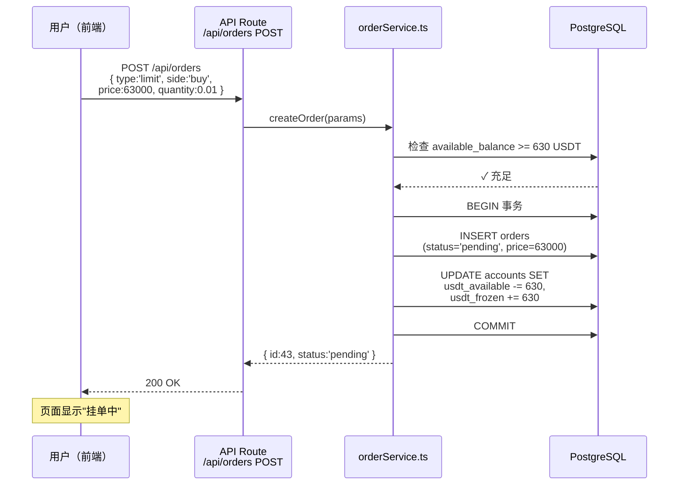
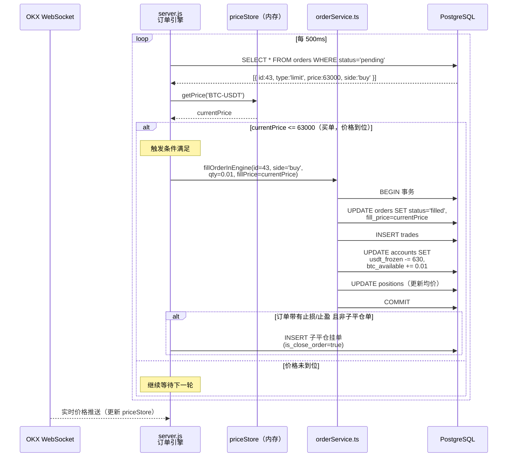
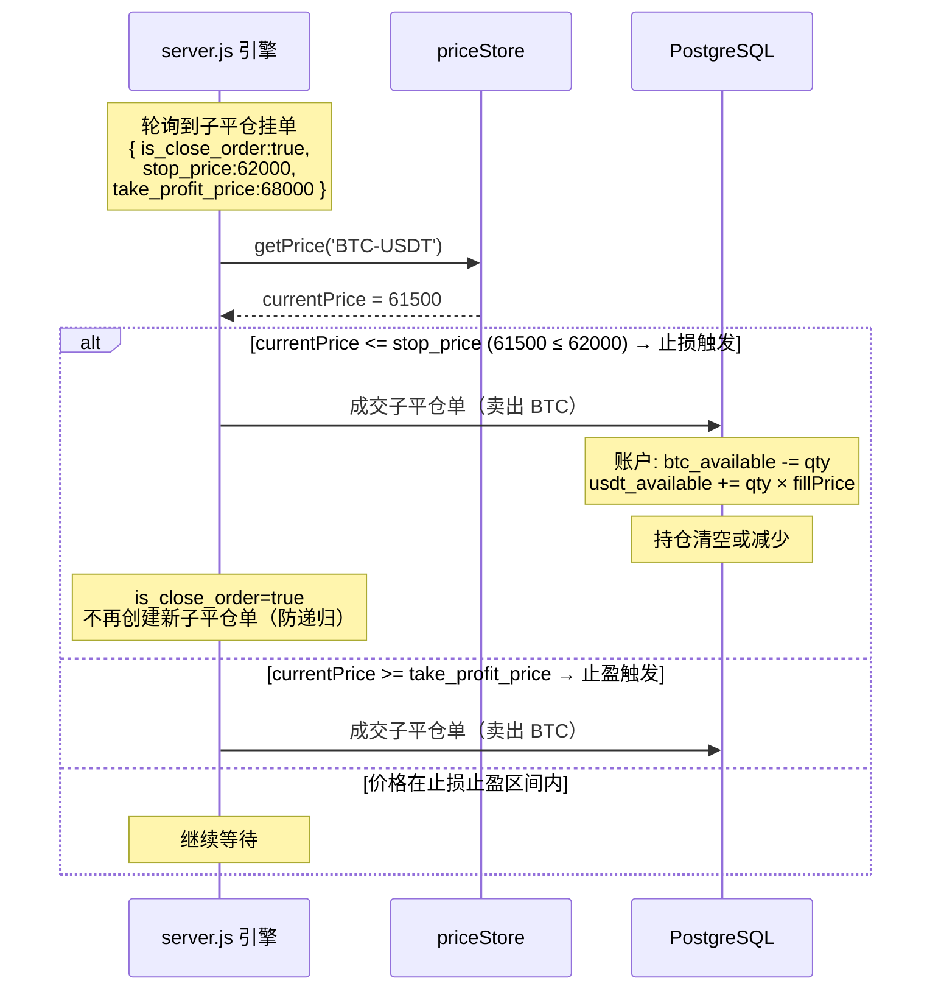
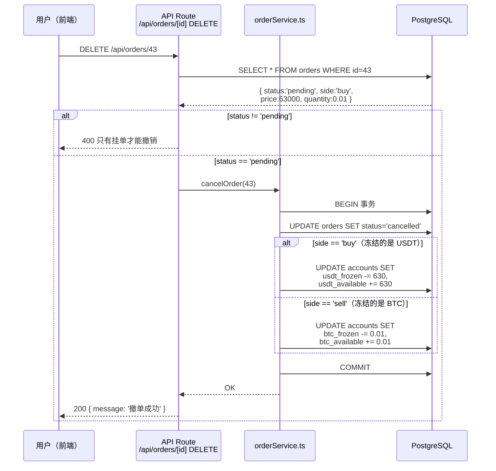

# 订单生命周期与时序图

> 本文描述订单从创建到终结的完整生命周期，以及各类场景下的系统内部交互时序。

---

## 目录

1. [订单状态机](#1-订单状态机)
2. [市价单时序图](#2-市价单时序图)
3. [限价单时序图](#3-限价单时序图)
4. [止损/止盈触发时序图](#4-止损止盈触发时序图)
5. [撤单时序图](#5-撤单时序图)
6. [账户余额变化时序](#6-账户余额变化时序)

---

## 1. 订单状态机

### 状态定义

| 状态 | 说明 | 可操作 |
|------|------|--------|
| `pending` | 挂单中，等待价格触发 | 可撤单 |
| `filled` | 已全部成交，资产已划转 | 不可操作 |
| `cancelled` | 已撤销，冻结资金已解冻 | 不可操作 |

### 状态转移图



### ASCII 版（无 Mermaid 环境）

```
                    ┌─────────────────────────────┐
                    │           下单                │
                    └──────────┬──────────┬────────┘
                               │          │
                          限价单           市价单
                               │          │
                               ▼          ▼
                           pending     filled ◄──── 终态
                           （挂单中）  （已成交）
                           │
              ┌────────────┴────────────┐
              │                         │
         价格触发                    用户撤单
              │                         │
              ▼                         ▼
           filled                  cancelled ◄──── 终态
          （已成交）               （已撤销）
```

---

## 2. 市价单时序图

市价单的特点：**下单即成交**，不进入挂单队列。



---

## 3. 限价单时序图

限价单分为两个阶段：**下单挂起** + **引擎触发成交**。

### 阶段一：下单



### 阶段二：引擎触发成交



---

## 4. 止损/止盈触发时序图

止损/止盈本质是一种**特殊的限价单自动成交**，触发逻辑与限价单相同，但判断方向固定。



### 止损止盈价格示意

```
  价格轴
  ────────────────────────────────────────────►

  61000     62000       65000       68000     69000
    │          │           │           │
    │        止损价      当前价       止盈价
    │      ← 触发区                  触发区 →
    │
    └── 价格跌到此处 → 自动卖出（止损）
                                        价格涨到此处 → 自动卖出（止盈）
```

---

## 5. 撤单时序图



---

## 6. 账户余额变化时序

以下展示一次完整交易循环中账户各字段的变化过程。

**初始状态**：10000 USDT / 0 BTC

```
操作                         USDT可用    USDT冻结    BTC可用    BTC冻结
────────────────────────────────────────────────────────────────────────
初始                         10000        0           0          0

① 限价买 0.01 BTC @ 63000    9370         630         0          0
  （挂单，冻结 630 USDT）

② 价格跌到 63000，订单成交    9370         0           0.01       0
  冻结解冻 → 换成 BTC

③ 对持仓设止盈 @ 68000        9370         0           0.01       0
  （子平仓挂单 pending，不冻结 BTC？*）

④ 价格涨到 68000，止盈触发    10050        0           0          0
  卖出 0.01 BTC → +680 USDT
  利润 = 680 - 630 = +50 USDT
────────────────────────────────────────────────────────────────────────
```

> *注：当前实现中，子平仓挂单（`is_close_order=true`）的卖单不单独冻结 BTC，
> 因为持仓本身已代表持有量。正式交易所通常会冻结对应 BTC，本系统为简化处理。

---

## 附：各时序图参与者说明

| 参与者 | 文件 | 职责 |
|--------|------|------|
| 用户（前端） | `app/page.tsx` | 发起 HTTP 请求，展示数据 |
| API Route | `app/api/orders/route.ts` | 请求校验、调用 service |
| orderService | `lib/orderService.ts` | 业务逻辑、数据库操作 |
| server.js 引擎 | `server.js` | 500ms 轮询、触发成交 |
| priceStore | `server.js` 内存 | `global.__priceStore` 实时价格 |
| OKX WebSocket | 外部 | 推送实时行情到 server.js |
| PostgreSQL | 数据库 | 持久化所有状态 |

---

> 返回核心概念：[concepts.md](./concepts.md) | 系统设计：[design.md](./design.md)
